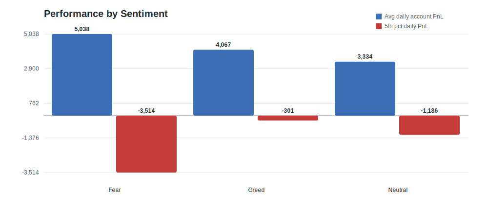
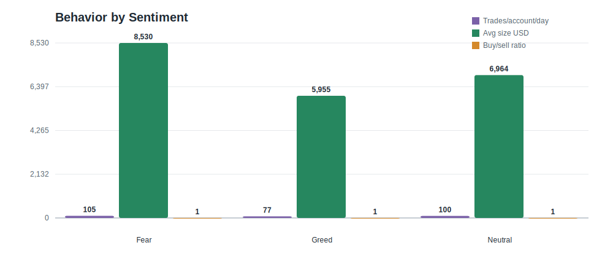
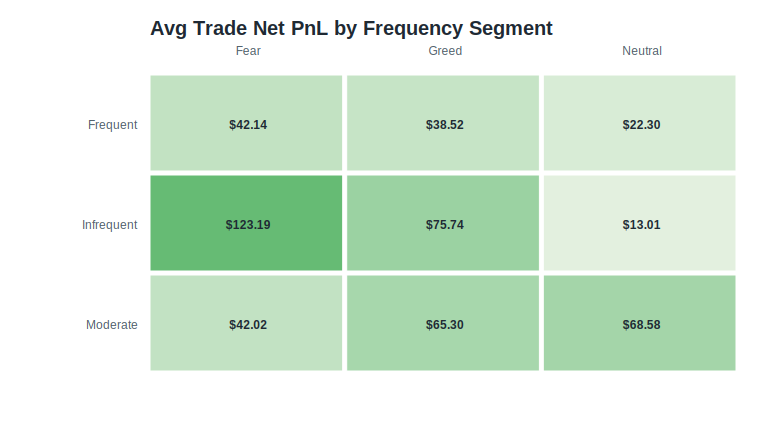
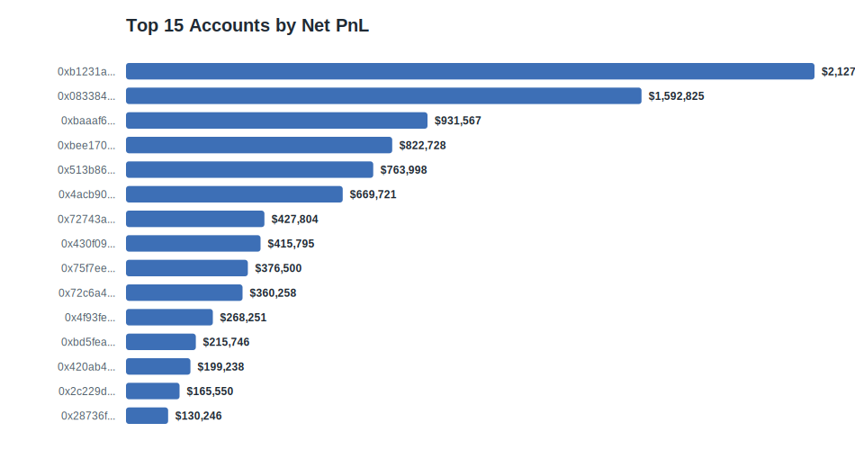

# Trader Performance vs Market Sentiment

## Executive summary

This analysis joins Hyperliquid trader executions to the Bitcoin Fear & Greed Index at the daily level. The trader file does not include an explicit `leverage` column, so leverage distribution could not be measured directly. I used available risk/behavior proxies instead: average USD trade size, total notional, starting-position exposure relative to trade size, fee burden, frequency, and buy/sell bias.

Key findings:

1. **Performance differs by sentiment.** Fear days produced $3,979,920.11 total net PnL versus $4,775,171.23 on Greed days. The average daily account PnL gap was $970.44 higher on Fear days.
2. **Trader behavior changes with sentiment.** Fear days had 105.36 trades per account-day versus 76.91 on Greed days, with average size of $8,529.86 versus $5,954.63.
3. **Segments matter more than the headline average.** Frequent traders and high-size traders show different PnL sensitivity across Fear/Greed, which means sentiment rules should be segment-specific rather than applied uniformly.

## Part A: Data preparation

### Source data profile

| Dataset | Rows | Columns | Duplicate rows |
|---|---:|---:|---:|
| Fear/Greed index | 2,644 | 4 | 0 |
| Historical trader data | 211,224 | 16 | 0 |

Date coverage:

| Field | Value |
|---|---|
| Sentiment date range | 2018-02-01 to 2025-05-02 |
| Trade date range | 2023-05-01 to 2025-05-01 |
| Matched trade rows | 211,218 |
| Unmatched trade rows | 6 |

Missing-value notes:

- Sentiment columns with missing values: none.
- Trader columns with missing values: none.
- The assignment mentions leverage, but no leverage column exists in the supplied trader CSV. No direct leverage statistics were calculated.

### Metrics created

- Daily PnL per account: `sum(Closed PnL - Fee)` by `date/account`.
- Win rate: profitable realized trades divided by non-zero `Closed PnL` trades.
- Average trade size: mean `Size USD`.
- Trade frequency: executions per account-day and per trader active day.
- Long/short proxy: buy/sell execution ratio from `Side`.
- Drawdown proxy: worst cumulative daily account PnL drop by account, plus 5th percentile daily account PnL by sentiment.
- Risk proxies: average USD notional, total USD notional, fee bps, and starting-position exposure divided by trade size.

## Part B: Analysis

### 1. Performance by sentiment

| sentiment | account_days | trades | net_pnl       | avg_daily_account_pnl | median_daily_account_pnl | win_rate | pnl_5pct   | negative_account_day_rate |
| --------- | ------------ | ------ | ------------- | --------------------- | ------------------------ | -------- | ---------- | ------------------------- |
| Fear      | 790          | 83237  | $3,979,920.11 | $5,037.87             | $104.55                  | 84.2%    | $-3,514.16 | 38.5%                     |
| Greed     | 1174         | 90295  | $4,775,171.23 | $4,067.44             | $235.92                  | 85.6%    | $-300.84   | 35.1%                     |
| Neutral   | 376          | 37686  | $1,253,546.41 | $3,333.90             | $151.37                  | 83.6%    | $-1,186.07 | 35.6%                     |

Interpretation: compare both average and tail metrics. Total PnL can be dominated by large accounts, so average account-day PnL, median account-day PnL, and the 5th percentile daily PnL are better indicators of whether sentiment changes the typical and downside experience.

### 2. Behavior by sentiment

| sentiment | avg_trades_per_account_day | avg_size_usd | total_size_usd  | long_short_ratio | fee_bps |
| --------- | -------------------------- | ------------ | --------------- | ---------------- | ------- |
| Fear      | 105.36                     | $8,529.86    | $597,809,051.23 | 0.98             | 4.93    |
| Greed     | 76.91                      | $5,954.63    | $413,047,659.29 | 0.89             | 2.53    |
| Neutral   | 100.23                     | $6,963.69    | $180,242,063.08 | 1.01             | 4.49    |

Interpretation: sentiment affects both participation and risk appetite. A higher buy/sell ratio implies more aggressive long-side activity, while higher average size and fee bps indicate more notional exposure and trading friction.

### 3. Segment analysis

Frequency segment summary:

| segment    | sentiment | accounts | trades | net_pnl       | avg_trade_pnl | avg_size_usd | buy_share | win_rate |
| ---------- | --------- | -------- | ------ | ------------- | ------------- | ------------ | --------- | -------- |
| Infrequent | Fear      | 11       | 5853   | $721,012.56   | $123.19       | $8,580.79    | 53.1%     | 78.1%    |
| Infrequent | Greed     | 11       | 8349   | $632,365.06   | $75.74        | $11,445.13   | 46.1%     | 94.0%    |
| Infrequent | Neutral   | 10       | 3377   | $43,928.36    | $13.01        | $9,431.39    | 53.4%     | 86.0%    |
| Moderate   | Fear      | 10       | 18615  | $782,274.30   | $42.02        | $3,539.75    | 48.4%     | 82.2%    |
| Moderate   | Greed     | 10       | 36815  | $2,404,151.28 | $65.30        | $2,379.90    | 46.9%     | 85.5%    |
| Moderate   | Neutral   | 10       | 9607   | $658,804.87   | $68.58        | $2,687.42    | 45.2%     | 88.1%    |
| Frequent   | Fear      | 11       | 58769  | $2,476,633.25 | $42.14        | $8,196.38    | 49.5%     | 85.8%    |
| Frequent   | Greed     | 10       | 45131  | $1,738,654.89 | $38.52        | $5,093.53    | 47.4%     | 77.9%    |
| Frequent   | Neutral   | 11       | 24702  | $550,813.18   | $22.30        | $4,962.12    | 51.9%     | 79.4%    |

Size segment summary:

| segment     | sentiment | accounts | trades | net_pnl       | avg_trade_pnl | avg_size_usd | buy_share | win_rate |
| ----------- | --------- | -------- | ------ | ------------- | ------------- | ------------ | --------- | -------- |
| Low size    | Fear      | 11       | 32293  | $515,926.76   | $15.98        | $1,372.31    | 48.3%     | 77.2%    |
| Low size    | Greed     | 11       | 56735  | $996,785.20   | $17.57        | $1,328.96    | 46.5%     | 80.0%    |
| Low size    | Neutral   | 11       | 19101  | $72,577.64    | $3.80         | $1,354.58    | 51.3%     | 74.7%    |
| Medium size | Fear      | 10       | 28518  | $1,068,749.71 | $37.48        | $3,295.15    | 50.5%     | 91.4%    |
| Medium size | Greed     | 10       | 20108  | $2,649,606.59 | $131.77       | $3,942.16    | 46.5%     | 88.2%    |
| Medium size | Neutral   | 9        | 10763  | $569,935.24   | $52.95        | $2,513.60    | 51.1%     | 91.5%    |
| High size   | Fear      | 11       | 22426  | $2,395,243.64 | $106.81       | $20,490.59   | 50.0%     | 86.0%    |
| High size   | Greed     | 10       | 13452  | $1,128,779.44 | $83.91        | $19,207.58   | 50.3%     | 83.3%    |
| High size   | Neutral   | 11       | 7822   | $611,033.53   | $78.12        | $16,276.45   | 46.9%     | 86.2%    |

Winner consistency segment summary:

| segment              | sentiment | accounts | trades | net_pnl       | avg_trade_pnl | avg_size_usd | buy_share | win_rate |
| -------------------- | --------- | -------- | ------ | ------------- | ------------- | ------------ | --------- | -------- |
| Consistent winners   | Fear      | 16       | 36759  | $1,830,404.88 | $49.79        | $9,920.29    | 53.2%     | 93.7%    |
| Consistent winners   | Greed     | 16       | 39533  | $1,806,542.86 | $45.70        | $6,721.52    | 53.8%     | 93.0%    |
| Consistent winners   | Neutral   | 15       | 18314  | $724,207.51   | $39.54        | $6,461.30    | 54.7%     | 95.1%    |
| Inconsistent winners | Fear      | 12       | 36866  | $2,010,152.76 | $54.53        | $2,921.87    | 47.7%     | 76.3%    |
| Inconsistent winners | Greed     | 12       | 48203  | $3,422,196.21 | $71.00        | $2,758.32    | 40.6%     | 74.7%    |
| Inconsistent winners | Neutral   | 12       | 17480  | $501,556.55   | $28.69        | $2,711.90    | 47.7%     | 72.7%    |
| Net losers           | Fear      | 4        | 9612   | $139,362.46   | $14.50        | $13,049.48   | 42.2%     | 83.4%    |
| Net losers           | Greed     | 3        | 2559   | $-453,567.84  | $-177.24      | $5,614.20    | 66.9%     | 66.5%    |
| Net losers           | Neutral   | 4        | 1892   | $27,782.35    | $14.68        | $7,666.93    | 32.5%     | 50.3%    |

Top accounts by net PnL:

| account_short | trades | active_days | net_pnl       | avg_size_usd | win_rate | frequency_segment | size_segment | winner_segment       | max_drawdown_proxy |
| ------------- | ------ | ----------- | ------------- | ------------ | -------- | ----------------- | ------------ | -------------------- | ------------------ |
| 0xb1231a4a... | 14733  | 256         | $2,127,387.28 | $3,837.89    | 79.1%    | Moderate          | Medium size  | Inconsistent winners | $-16,092.35        |
| 0x083384f8... | 3818   | 24          | $1,592,824.51 | $16,159.58   | 79.3%    | Frequent          | High size    | Inconsistent winners | $-328,451.00       |
| 0xbaaaf657... | 21192  | 28          | $931,567.10   | $3,210.47    | 99.1%    | Frequent          | Medium size  | Consistent winners   | $-306.11           |
| 0xbee1707d... | 40184  | 131         | $822,727.65   | $1,844.21    | 76.3%    | Frequent          | Low size     | Inconsistent winners | $-83,646.66        |
| 0x513b8629... | 12236  | 39          | $763,997.91   | $34,396.58   | 89.5%    | Frequent          | High size    | Consistent winners   | $-71,715.26        |
| 0x4acb90e7... | 4356   | 58          | $669,721.06   | $9,084.70    | 94.8%    | Moderate          | High size    | Consistent winners   | $-2,467.24         |
| 0x72743ae2... | 1590   | 19          | $427,804.13   | $7,216.67    | 74.6%    | Frequent          | High size    | Inconsistent winners | $-58,349.38        |
| 0x430f0984... | 1237   | 28          | $415,794.87   | $2,397.82    | 100.0%   | Moderate          | Medium size  | Consistent winners   | $-143.25           |
| 0x75f7eeb8... | 9893   | 146         | $376,500.15   | $2,600.78    | 92.6%    | Moderate          | Medium size  | Consistent winners   | $-22,360.21        |
| 0x72c6a462... | 1424   | 65          | $360,258.01   | $2,080.39    | 77.4%    | Infrequent        | Low size     | Inconsistent winners | $-10,762.50        |

## Part C: Actionable output

1. **Use sentiment as a risk throttle, not a standalone signal.** If a trader falls into the high-size segment, cap notional size when the sentiment bucket historically shows weaker 5th percentile PnL or higher negative account-day rate. This protects against the days when large accounts dominate losses.
2. **Let only proven frequent traders scale activity.** Frequent traders should be allowed to increase trade count only in the sentiment bucket where their average trade PnL and win rate are positive. Infrequent or net-losing traders should reduce activity during the weaker sentiment bucket because execution frequency compounds fees and downside.
3. **Monitor buy/sell imbalance by sentiment.** A sharp rise in buy/sell ratio on Greed days can indicate crowded long exposure. For accounts already showing weak win rate, reduce long-side size or require tighter stop/risk limits during those periods.

## Bonus: lightweight predictive model

A simple **Sentiment historical-rate baseline** model was trained to predict whether the next trading day would be net profitable using sentiment and recent behavior features where available. It used 478 daily observations and held out 144 rows for testing.

- Accuracy: 75.0%
- ROC AUC: 0.548

This is a directionally useful baseline, not a production trading model. It should be validated with walk-forward splits and richer market features before use.

## Deliverables

- `outputs/sentiment_summary.csv`
- `outputs/segment_summary.csv`
- `outputs/account_segments.csv`
- `outputs/daily_account_metrics.csv`
- `outputs/daily_market_metrics.csv`
- `outputs/charts/*.svg`
